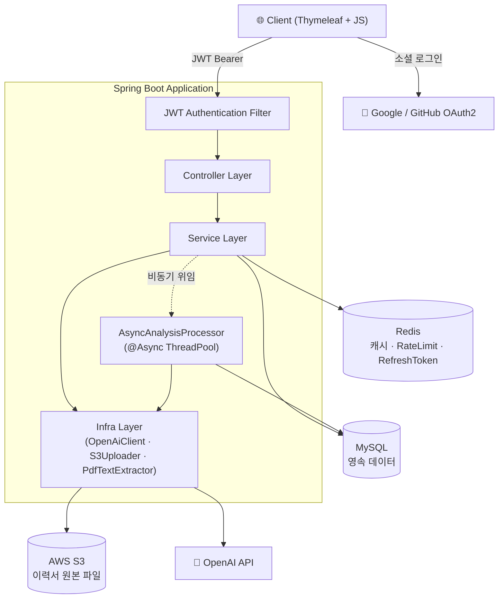
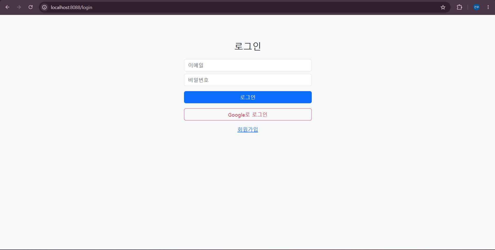
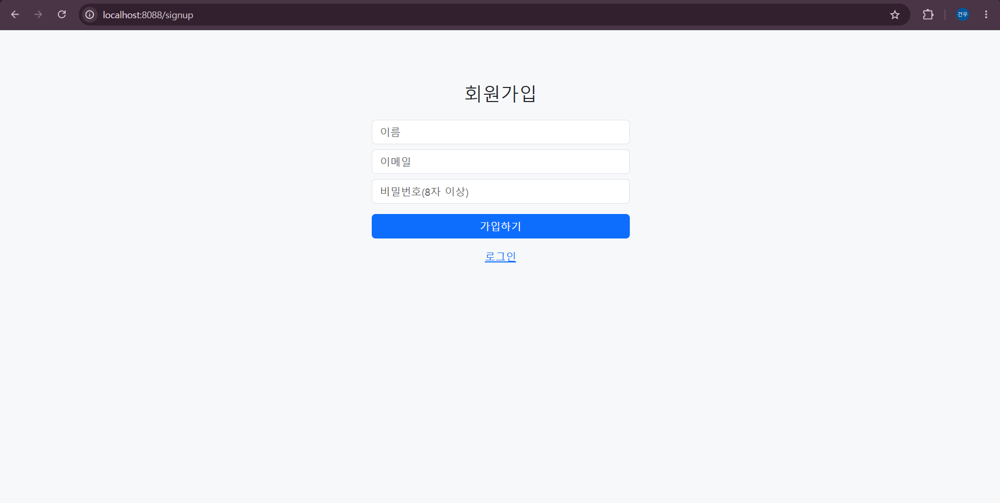
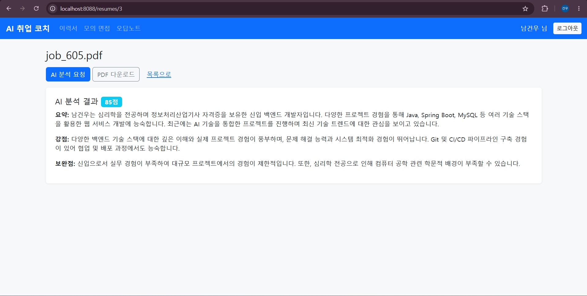
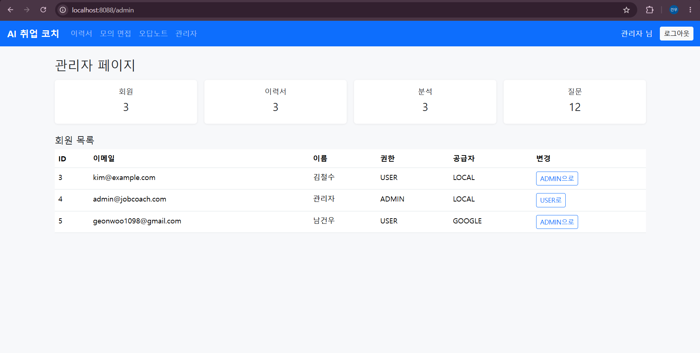

# 📄 Job Reader — AI 이력서 분석 & 면접 코칭 서비스

> PDF 이력서를 업로드하면 AI가 자동으로 분석하고, 이력서 기반 모의 면접 질문 생성·답변 채점·오답노트까지 제공하는 취업 준비 올인원 플랫폼

<p align="left">
  
  
  
  
  
  
  
</p>

---

## 📑 목차

1. [만든 이유](#1-만든-이유)
2. [기술 스택](#2-기술-스택)
3. [프로젝트 아키텍처](#3-프로젝트-아키텍처)
4. [ERD](#4-erd)
5. [REST API](#5-rest-api)
6. [주요 기능](#6-주요-기능)
7. [화면](#7-화면)
8. [트러블슈팅](#8-트러블슈팅)
9. [추후 구현할 기능](#9-추후-구현할-기능)

---

## 1. 만든 이유

취업을 준비하면서 느낀 두 가지 불편함에서 출발했습니다.

- **이력서를 객관적으로 평가받기 어렵다.** 주변에 첨삭을 부탁할 사람이 한정적이고, 받더라도 사람마다 기준이 달라 일관성이 없었습니다.
- **면접 연습 환경이 부족하다.** 막상 면접장에 가서야 내 답변의 부족함을 깨닫는 경우가 많았습니다.

그래서 **"이력서 업로드 한 번으로, 이력서 분석부터 맞춤형 모의 면접·오답 복습까지 한 흐름에서 해결하는 서비스"** 를 직접 만들어보기로 했습니다.

기능 구현을 넘어서, 실제 서비스 운영에서 마주치는 문제들을 다뤄보는 것을 목표로 삼았습니다.

- 외부 AI API의 **느린 응답을 어떻게 비동기로 처리**할 것인가
- 동일 요청에 대한 **불필요한 API 비용을 어떻게 캐싱으로 절감**할 것인가
- 비용이 드는 AI 호출을 **사용자별로 어떻게 제한(Rate Limit)** 할 것인가
- 파일 업로드를 **어떻게 안전하게 클라우드 스토리지에 저장**할 것인가

---

## 2. 기술 스택

### Backend
| 구분 | 기술 |
|------|------|
| Language | Java 17 |
| Framework | Spring Boot 3.5, Spring Web, Spring Data JPA |
| Security | Spring Security, JWT(jjwt), OAuth2 Client (Google / GitHub) |
| Database | MySQL 8.0 |
| Cache / Store | Redis 7 (분석 캐시 · Rate Limit · Refresh Token) |
| Migration | Flyway |
| File / AI | AWS S3 (SDK v2), Apache PDFBox, OpenAI Chat Completions API |
| View | Thymeleaf + Vanilla JS |

### Infra / DevOps
| 구분 | 기술 |
|------|------|
| Build | Gradle |
| Container | Docker, Docker Compose (App · MySQL · Redis) |
| Cloud | AWS S3 |

### Test
| 구분 | 기술 |
|------|------|
| Test | JUnit 5, Spring Boot Test, Spring Security Test |

---

## 3. 프로젝트 아키텍처



### 계층 구조
```
controller  ──  REST API 엔드포인트 (요청/응답 처리)
service     ──  비즈니스 로직 / 트랜잭션 경계
domain      ──  JPA 엔티티 (도메인 로직 캡슐화)
repository  ──  Spring Data JPA
infra       ──  외부 연동 (OpenAI · S3 · PDF · Cache · RateLimiter)
security    ──  JWT · OAuth2 · SecurityConfig
common      ──  공통 예외 처리 (GlobalExceptionHandler)
```

### 핵심 설계 포인트
- **무상태(Stateless) 인증**: 세션을 두지 않고 JWT(Access) + Redis(Refresh)로 인증을 관리해 수평 확장에 유리하도록 설계
- **비동기 AI 처리**: 느린 AI 분석을 `@Async` 전용 스레드풀로 분리해 사용자 응답을 즉시 반환(`202 Accepted`)
- **이중 비용 방어**: Redis 기반 **결과 캐싱**(동일 이력서 중복 호출 방지) + **일일 Rate Limit**(사용자별 호출 제한)

---

## 4. ERD

```mermaid
erDiagram
    users ||--o{ resume : "보유"
    users ||--o{ interview_question : "생성"
    users ||--o{ interview_answer : "작성"
    users ||--o{ wrong_answer_note : "소유"
    resume ||--o{ resume_analysis : "분석 이력"
    resume ||--o{ interview_question : "기반"
    interview_question ||--o{ interview_answer : "답변"
    interview_answer ||--|| wrong_answer_note : "오답 등록"

    users {
        bigint id PK
        varchar email UK
        varchar password "OAuth 가입 시 null"
        varchar name
        varchar role "USER / ADMIN"
        varchar provider "LOCAL / GOOGLE / GITHUB"
        varchar provider_id
    }
    resume {
        bigint id PK
        bigint user_id FK
        varchar original_filename
        varchar stored_key "S3 Key"
        longtext content_text "PDF 추출 텍스트"
        bigint file_size
        varchar status
    }
    resume_analysis {
        bigint id PK
        bigint resume_id FK
        varchar status "PENDING / COMPLETED / FAILED"
        longtext summary
        longtext strengths
        longtext weaknesses
        int score "0~100"
    }
    interview_question {
        bigint id PK
        bigint user_id FK
        bigint resume_id FK "nullable"
        longtext content
        varchar category
    }
    interview_answer {
        bigint id PK
        bigint question_id FK
        bigint user_id FK
        longtext content
        int ai_score
        longtext ai_feedback
    }
    wrong_answer_note {
        bigint id PK
        bigint user_id FK
        bigint answer_id FK UK
        longtext memo
        int review_count
    }
```

---

## 5. REST API

### 🔐 Auth — `/api/auth`
| Method | Endpoint | 설명 | 인증 |
|--------|----------|------|:---:|
| `POST` | `/api/auth/signup` | 회원가입 | - |
| `POST` | `/api/auth/login` | 로그인 (Access 발급 + Refresh 쿠키) | - |
| `POST` | `/api/auth/reissue` | Access Token 재발급 | Refresh Cookie |
| `POST` | `/api/auth/logout` | 로그아웃 (Refresh 폐기) | ✅ |

### 👤 User — `/api/users`
| Method | Endpoint | 설명 | 인증 |
|--------|----------|------|:---:|
| `GET` | `/api/users/me` | 내 정보 조회 | ✅ |

### 📄 Resume — `/api/resumes`
| Method | Endpoint | 설명 | 인증 |
|--------|----------|------|:---:|
| `POST` | `/api/resumes` | 이력서 업로드 (PDF) | ✅ |
| `GET` | `/api/resumes` | 내 이력서 목록 | ✅ |
| `GET` | `/api/resumes/{id}` | 이력서 상세 | ✅ |
| `GET` | `/api/resumes/{id}/download` | S3 Presigned 다운로드 URL | ✅ |
| `DELETE` | `/api/resumes/{id}` | 이력서 삭제 (S3 포함) | ✅ |

### 🧠 Resume Analysis — `/api/resumes/{resumeId}/analyses`
| Method | Endpoint | 설명 | 인증 |
|--------|----------|------|:---:|
| `POST` | `/.../analyses` | AI 분석 요청 (비동기, `202 Accepted`) | ✅ |
| `GET` | `/.../analyses` | 분석 이력 조회 | ✅ |
| `GET` | `/.../analyses/latest` | 최신 분석 결과 조회 | ✅ |

### 🎤 Interview — `/api/interviews`
| Method | Endpoint | 설명 | 인증 |
|--------|----------|------|:---:|
| `POST` | `/api/interviews/questions` | AI 면접 질문 생성 | ✅ |
| `GET` | `/api/interviews/questions` | 내 질문 목록 | ✅ |
| `POST` | `/api/interviews/questions/{id}/answers` | 답변 제출 + AI 채점 | ✅ |
| `GET` | `/api/interviews/answers/{id}` | 답변 상세 조회 | ✅ |

### 📒 Wrong Answer Note — `/api/notes`
| Method | Endpoint | 설명 | 인증 |
|--------|----------|------|:---:|
| `GET` | `/api/notes` | 오답노트 목록 | ✅ |
| `PATCH` | `/api/notes/{id}` | 메모 수정 | ✅ |
| `DELETE` | `/api/notes/{id}` | 오답노트 삭제 | ✅ |

### 🛠️ Admin — `/api/admin` (`ROLE_ADMIN`)
| Method | Endpoint | 설명 | 인증 |
|--------|----------|------|:---:|
| `GET` | `/api/admin/users` | 회원 목록 (페이징) | 👑 |
| `PATCH` | `/api/admin/users/{id}/role` | 회원 권한 변경 | 👑 |
| `GET` | `/api/admin/stats` | 서비스 통계 | 👑 |

---

## 6. 주요 기능

### 🔑 인증 / 인가
- **JWT 기반 무상태 인증**: Access Token(Header) + Refresh Token(HttpOnly·Secure·SameSite 쿠키)
- **Refresh Token Rotation**: Redis에 저장·검증하여 재발급 시 회전, 로그아웃 시 즉시 무효화
- **소셜 로그인**: Google · GitHub OAuth2 연동, 가입과 동시에 JWT 발급
- **권한 분리**: `ROLE_USER` / `ROLE_ADMIN` 메서드 시큐리티(`@PreAuthorize`)

### 📄 이력서 관리
- **PDF 업로드**: 파일 검증(확장자·크기 5MB) → PDFBox 텍스트 추출 → S3 저장
- **안전한 다운로드**: S3 Presigned URL로 한시적 접근 권한만 발급 (버킷 비공개 유지)
- **소유권 검증**: 모든 조회/삭제에서 본인 리소스 여부 확인

### 🧠 AI 이력서 분석
- **비동기 처리**: 요청 시 `PENDING` 레코드를 즉시 반환(`202`)하고, 전용 스레드풀에서 OpenAI 호출
- **결과 캐싱**: 이력서 텍스트의 SHA-256 해시를 키로 Redis에 24시간 캐싱 → 동일 이력서 재분석 시 API 비용 0
- **일일 호출 제한**: 사용자별 하루 분석 횟수 제한(Redis `INCR` + TTL)
- **결과 구조화**: 요약 / 강점 / 보완점 / 점수(0~100) JSON 강제 응답

### 🎤 모의 면접
- **맞춤 질문 생성**: 업로드한 이력서 기반 + 카테고리(예: 기술/인성)별 질문 생성
- **AI 답변 채점**: 제출 답변을 점수(0~100) + 구체적 피드백으로 평가
- **오답노트 자동 생성**: 합격선(`pass-line`) 미만 답변은 자동으로 오답노트에 등록

### 📒 오답노트
- 채점 미달 답변 자동 수집, 개인 메모 추가/수정, 복습 횟수 관리

### 🛠️ 관리자
- 회원 목록(페이징) 조회, 권한 변경, 서비스 통계 대시보드

---

## 7. 화면

> 아래 ▼ 토글을 클릭하면 화면 캡처를 볼 수 있습니다. (이미지는 추후 첨부 예정)

<details>
<summary>🏠 <b>메인 / 대시보드</b></summary>

<br>

<!-- 여기에 이미지를 추가하세요 -->
<!--  -->

</details>

<details>
<summary>🔑 <b>로그인 / 회원가입 (소셜 로그인 포함)</b></summary>

<br>

<!--  -->
<!--  -->

</details>

<details>
<summary>📄 <b>이력서 업로드 / 목록</b></summary>

<br>

<!--  -->

</details>

<details>
<summary>🧠 <b>AI 이력서 분석 결과</b></summary>

<br>

<!--  -->

</details>

<details>
<summary>🎤 <b>모의 면접 (질문 생성 / 답변 채점)</b></summary>

<br>

<!--  -->

</details>

<details>
<summary>📒 <b>오답노트</b></summary>

<br>

<!--  -->

</details>

<details>
<summary>🛠️ <b>관리자 페이지</b></summary>

<br>

<!--  -->

</details>

---

## 8. 트러블슈팅

<details>
<summary><b>1. AI API의 느린 응답으로 인한 요청 지연</b></summary>

<br>

**문제**
이력서 분석은 OpenAI API 호출에 수 초~수십 초가 걸려, 동기 처리 시 사용자가 응답을 받기까지 그대로 대기해야 했습니다. 요청 스레드가 외부 I/O에 묶여 처리량도 저하됐습니다.

**해결**
- 분석 요청 시 `PENDING` 상태의 레코드를 먼저 저장하고 **`202 Accepted` + 결과 조회 URL(Location)** 을 즉시 반환
- 실제 AI 호출은 `@Async("aiTaskExecutor")` 전용 스레드풀로 분리
- 클라이언트는 `/analyses/latest` 폴링으로 `COMPLETED` 결과 확인
- 처리 실패 시 상태를 `FAILED`로 전이시켜 사용자가 재시도 가능하도록 처리

**결과**: 응답 시간이 체감상 즉시(수 ms)로 단축되고, 요청 스레드가 외부 I/O에 점유되지 않게 됨.

</details>

<details>
<summary><b>2. 동일 이력서 반복 분석으로 인한 불필요한 API 비용</b></summary>

<br>

**문제**
같은 이력서를 여러 번 분석하면 매번 OpenAI를 호출해 비용과 시간이 낭비됐습니다.

**해결**
- 이력서 **텍스트의 SHA-256 해시**를 캐시 키로 사용해 Redis에 분석 결과를 24시간 저장
- 분석 전 캐시를 먼저 조회(`find`)하고, 없을 때만 API를 호출 후 저장(`save`)
- 내용이 동일하면 파일명이 달라도 캐시에 적중

**결과**: 동일 이력서 재분석 시 API 호출 0회, 응답도 캐시에서 즉시 반환.

</details>

<details>
<summary><b>3. 비용이 드는 AI 호출의 무제한 사용 방지</b></summary>

<br>

**문제**
AI 호출은 건당 비용이 발생하므로, 한 사용자가 무제한으로 분석을 요청하면 비용이 통제 불가능해집니다.

**해결**
- `AI:LIMIT:{userId}:{date}` 키로 Redis `INCR`를 사용한 **일일 카운터** 구현
- 카운트가 처음 1이 될 때만 TTL(1일)을 설정해 자정 기준 자동 초기화
- 한도 초과 시 `ResumeAnalysisLimitExceededException`을 던져 `GlobalExceptionHandler`에서 일관된 에러 응답으로 변환

**결과**: 원자적 연산(`INCR`)으로 동시 요청에도 정확한 호출 수 제어.

</details>

<details>
<summary><b>4. 업로드 파일을 안전하게 저장·제공하기</b></summary>

<br>

**문제**
이력서는 민감한 개인정보이므로 외부에 공개되면 안 되지만, 동시에 사용자가 다운로드는 할 수 있어야 했습니다.

**해결**
- S3 버킷을 **비공개**로 유지하고, 다운로드 시점에 **Presigned URL**을 발급해 한시적 접근만 허용
- 업로드 단계에서 확장자·크기(5MB) 검증을 거쳐 부적합 파일 차단
- 이력서 삭제 시 DB 레코드와 S3 객체를 함께 제거해 고아 객체 방지

**결과**: 버킷 공개 없이도 안전한 업로드/다운로드 흐름 확보.

</details>

<details>
<summary><b>5. LLM 응답 형식의 불안정성</b></summary>

<br>

**문제**
AI가 자연어 설명을 덧붙이거나 형식이 흔들리면 JSON 파싱이 실패할 수 있었습니다.

**해결**
- System 프롬프트로 **"JSON 형식으로만 응답"** 을 명시하고, Chat Completions의 `response_format: json_object`를 사용해 JSON 출력을 강제
- 점수 값은 `clampScore`로 0~100 범위를 보정해 비정상 값 방어
- 빈 응답·파싱 실패를 명확한 예외로 처리해 분석 상태를 `FAILED`로 안전하게 전이

**결과**: 외부 응답 변동에도 안정적으로 구조화된 결과를 저장.

</details>

<details>
<summary><b>6. 화면(View)과 데이터(API)의 인증 경로 충돌</b></summary>

<br>

**문제**
SPA처럼 동작하는 Thymeleaf 화면은 누구나 접근 가능해야 하지만, 실제 데이터는 보호되어야 했습니다. 두 요구사항을 한 SecurityConfig에서 처리해야 했습니다.

**해결**
- **화면 경로(`/resumes/**` 등)는 공개 셸**로 `permitAll`, **데이터 경로(`/api/**`)는 JWT 인증** 필수로 분리
- 클라이언트가 화면 로드 후 JS로 `/api/**`를 Bearer 토큰과 함께 호출하는 구조로 설계

**결과**: 화면은 자유롭게 열리되 실제 데이터는 토큰으로 보호되는 명확한 경계 확립.

</details>

---

## 9. 추후 구현할 기능

- [ ] **AWS 배포 자동화**: GitHub Actions CI/CD + ECS/EC2 배포 파이프라인 구축
- [ ] **실시간 분석 진행 알림**: 폴링 대신 SSE/WebSocket으로 분석 완료 푸시
- [ ] **이력서 버전 관리**: 분석 결과를 비교하며 이력서 개선 추이 추적
- [ ] **음성 모의 면접**: STT를 활용한 음성 답변 입력 및 평가
- [ ] **직무/공고 맞춤 분석**: 채용 공고를 함께 입력해 JD 기반 적합도 분석
- [ ] **분석 통계 대시보드 고도화**: 사용자별 점수 추이·취약 카테고리 시각화
- [ ] **테스트 커버리지 확대**: 통합 테스트 및 핵심 서비스 단위 테스트 보강

---

<p align="center">
  <i>본 프로젝트는 포트폴리오 목적으로 제작되었습니다.</i>
</p>
